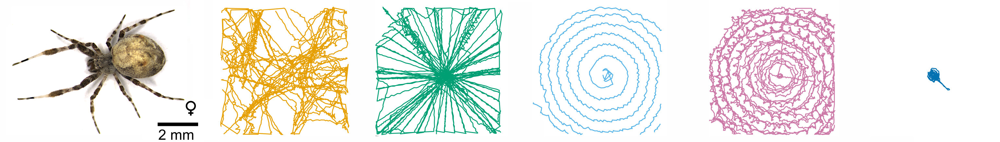

This repository accompanies the manuscript:

> **Distinct movement patterns generate stages of spider web-building**  
> Abel Corver, Nicholas Wilkerson, Jeremiah Miller, Andrew G Gordus  
> bioRxiv 2021.05.24.444987; doi: https://doi.org/10.1101/2021.05.24.444987 

Correspondence may be addressed to:
* Andrew Gordus, agordus@jhu.edu
* Abel Corver, abel.corver@gmail.com

### About this repository
The complete codebase used for generating the data and figures as they appear in the paper preprint is now available here. Note that further code documentation and comments will be included prior to publication.

### Abstract:
The geometric complexity and stereotypy of spider webs have long generated interest in their algorithmic origin. Like other examples of animal architecture, web construction is the result of several assembly phases that are driven by distinct behavioral stages coordinated to build a successful structure. Manual observations have revealed a range of sensory cues and movement patterns used during web construction, but methods to systematically quantify the dynamics of these sensorimotor patterns are lacking. Here, we apply an analytical pipeline to quantify web-making behavior of the orb-weaver Uloborus diversus. Position tracking revealed stereotyped stages of construction that could occur in typical or atypical progressions across individuals. Using an unsupervised clustering approach, we identified general and stage-specific leg movements. A Hierarchical Hidden Markov Model revealed that stages of web-building are characterized by stereotyped sequences of actions largely shared across individuals, regardless of whether these stages progress in a typical or atypical fashion. Web stages could be predicted based on action-sequences alone, revealing that web-stages are a physical manifestation of underlying behavioral phases.